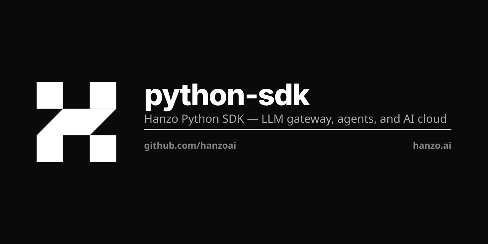

> **Retired — this is a stale copy of `hanzoai/python-sdk`.**
>
> All 22 branches here are reachable from `hanzoai/python-sdk`, which is also the
> copy that mirrors to GitHub. This one mirrors nowhere, so anything committed
> here would have stayed here.

<p align="center"></p>

# Hanzo Python SDK

**The flagship Python SDK for the Open AI Cloud — models, agents, tools, memory, and MCP in one install.**

[](https://github.com/hanzoai/python-sdk/actions/workflows/ci.yml)
[](https://pypi.org/project/hanzoai/)
[](https://pypi.org/project/hanzoai/)
[](LICENSE)

This is the most complete Hanzo SDK — a `uv` workspace of 60+ composable packages
covering the full AI surface: the typed cloud client, an agent framework, the
Model Context Protocol server and tools, persistent memory + RAG, distributed
compute, and a batteries-included CLI. If you build AI in Python, start here.

## Install

```bash
pip install hanzo          # flagship: CLI + agents + MCP + client
```

Or install exactly what you need:

```bash
pip install hanzoai        # just the typed cloud API client
pip install "hanzo[all]"   # everything, including optional extras
```

## Quickstart

```python
from hanzoai import ApiClient, Configuration, AiOpenAICompatibleApi
from hanzoai import AiChatCompletionRequest, AiChatMessage

config = Configuration(host="https://api.hanzo.ai", access_token="sk-...")

with ApiClient(config) as client:
    ai = AiOpenAICompatibleApi(client)
    resp = ai.ai_create_chat_completion(
        AiChatCompletionRequest(
            model="zen-coder",
            messages=[AiChatMessage(role="user", content="Ship it.")],
        )
    )
    print(resp.choices[0].message.content)
```

Every route is `https://api.hanzo.ai/v1/<service>/*`. Models come from the **Zen**
family (our own models) plus any provider you connect — one typed client, no proxy
in the middle.

## Packages

The workspace splits cleanly by concern. The headline packages:

| Package | Purpose |
|---------|---------|
| `hanzoai` | Typed cloud API client (generated from the Hanzo OpenAPI surface). |
| `hanzo` | The `hanzo` CLI + runtime that ties everything together. |
| `hanzo-mcp` | Model Context Protocol server — discovers tools via entry points. |
| `hanzo-agents` / `hanzo-agent` | Agent framework — build and orchestrate agents and swarms. |
| `hanzo-network` | Distributed AI compute and node orchestration. |
| `hanzo-memory` | Persistent memory + RAG (SQLite, optional vector backends). |
| `hanzo-tools-*` | 60+ single-concern tool packages (`shell`, `browser`, `fs`, `code`, `vector`, `iam`, …), each exposing a `TOOLS` list. |

```
python-sdk/
└── pkg/
    ├── hanzoai/          # typed cloud client (OpenAPI-generated)
    ├── hanzo/            # CLI + runtime meta package
    ├── hanzo-mcp/        # MCP server (entry-point tool discovery)
    ├── hanzo-agents/     # agent framework
    ├── hanzo-network/    # distributed compute
    ├── hanzo-memory/     # memory + RAG
    └── hanzo-tools-*/    # composable tool packages
```

## CLI

`pip install hanzo` gives you the `hanzo` command:

```bash
hanzo chat            # chat with the Zen models
hanzo node            # start / manage a local compute node
hanzo mcp             # run the MCP server for your editor or agent
hanzo agent           # build and run agents
hanzo run             # run a workflow
hanzo cloud           # manage cloud resources
hanzo search          # AI-powered search
```

Run `hanzo --help` for the full command tree.

## Model Context Protocol (`hanzo-mcp`)

`hanzo-mcp` hosts the MCP server and discovers tools through
`[project.entry-points."hanzo.tools"]`, so any installed `hanzo-tools-*` package
lights up automatically.

```python
from hanzo_mcp import create_mcp_server

server = create_mcp_server()
server.register_tool(my_tool)
server.start()
```

## Agents (`hanzo-agents`)

```python
from hanzo_agents import Agent, Swarm

agent = Agent(
    name="researcher",
    model="zen-coder",
    instructions="You are a research assistant.",
)

swarm = Swarm([agent])
result = await swarm.run("Research quantum computing.")
```

## Network (`hanzo-network`)

```python
from hanzo_network import LocalComputeNode, DistributedNetwork

node = LocalComputeNode(node_id="node-001")
network = DistributedNetwork()
network.register_node(node)
```

## Memory (`hanzo-memory`)

Persistent memory and RAG backed by SQLite, with optional vector search
(`sqlite-vec`, `lancedb`, `kuzu`). Global state lives in `~/.hanzo/`; per-project
state in `.hanzo/`.

```python
from hanzo_memory import MemoryService

memory = MemoryService()
await memory.store("key", "value")
result = await memory.retrieve("key")
```

## Development

This is a `uv` workspace.

```bash
git clone https://github.com/hanzoai/python-sdk.git
cd python-sdk
uv sync --all-packages       # install the whole workspace

uv run pytest tests/ -v      # run tests
make lint                    # ruff lint
make format                  # ruff format
make type-check              # mypy / pyright
```

Per-package work:

```bash
uv run pytest pkg/hanzo-mcp -v
cd pkg/hanzo && uv build
```

## Configuration

```bash
HANZO_API_KEY=your-api-key
HANZO_BASE_URL=https://api.hanzo.ai
HANZO_LOG_LEVEL=INFO
```

Or `~/.hanzo/config.yaml`:

```yaml
api:
  key: your-api-key
  base_url: https://api.hanzo.ai
logging:
  level: INFO
```

## Security

- Transport is TLS 1.3+. Secrets belong in a KMS, never in source or plaintext.
- SOC 2 audit in progress; HIPAA BAA available.

Report vulnerabilities to **security@hanzo.ai**. See [SECURITY.md](SECURITY.md).

## Contributing

Contributions welcome — see [CONTRIBUTING.md](CONTRIBUTING.md). Use type hints,
add tests for new behavior, and run `make lint` before opening a PR.

## License

Apache License 2.0 — see [LICENSE](LICENSE).

## Support

- Docs: [docs.hanzo.ai](https://docs.hanzo.ai)
- Issues: [github.com/hanzoai/python-sdk/issues](https://github.com/hanzoai/python-sdk/issues)
- Email: support@hanzo.ai

## Hanzo — the Open AI Cloud

Open source · every language · on-chain settlement. [hanzo.ai](https://hanzo.ai) · [docs.hanzo.ai](https://docs.hanzo.ai)

**SDKs in every language** — [Python](https://github.com/hanzoai/python-sdk) (flagship) · [TypeScript](https://github.com/hanzo-js/sdk) · [Go](https://github.com/hanzo-go/sdk) · [Rust](https://github.com/hanzo-rs/sdk) · [C++](https://github.com/hanzo-cpp/sdk) · [Swift](https://github.com/hanzo-swift/sdk) · [Kotlin](https://github.com/hanzo-kt/sdk) · [umbrella](https://github.com/hanzoai/sdk)
