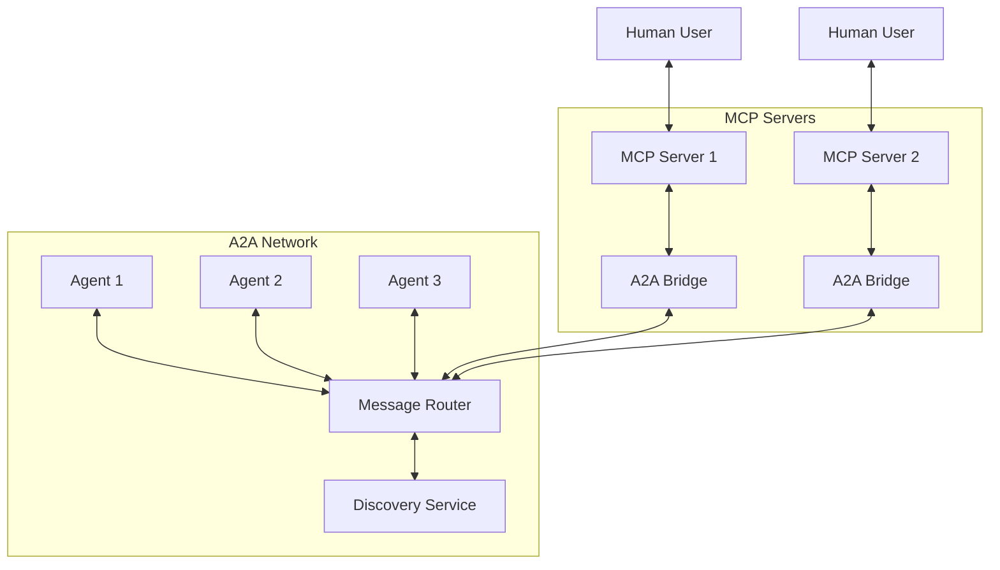

# hanzo-a2a Package Design

The `hanzo-a2a` (Agent-to-Agent) package provides a protocol and implementation for direct communication between AI agents, complementing MCP's human-to-agent focus.

## Package Structure

```
pkg/hanzo-a2a/
├── pyproject.toml
├── README.md
├── src/
│   └── hanzo_a2a/
│       ├── __init__.py
│       ├── protocol.py          # A2A wire protocol
│       ├── messages.py          # Message types
│       ├── transport.py         # Transport layers
│       ├── discovery.py         # Agent discovery
│       ├── routing.py           # Message routing
│       ├── auth.py             # Authentication
│       ├── encryption.py        # E2E encryption
│       ├── bridge.py           # MCP bridge
│       └── client.py           # A2A client
└── tests/
    ├── test_protocol.py
    ├── test_routing.py
    └── test_bridge.py
```

## Core Concepts

### A2A vs MCP
- **MCP**: Human ↔ Agent communication (tools, prompts)
- **A2A**: Agent ↔ Agent communication (tasks, results, coordination)

### Protocol Features
1. **Direct Messaging**: Agents communicate without human intermediary
2. **Task Delegation**: Agents can delegate subtasks to other agents
3. **Result Streaming**: Stream results as they're generated
4. **Discovery**: Find agents with specific capabilities
5. **Authentication**: Verify agent identities
6. **Encryption**: End-to-end encryption for sensitive data

## Protocol Design

### 1. Message Format (messages.py)
```python
from enum import Enum
from typing import Any, Dict, Optional, List
from pydantic import BaseModel, Field
import uuid
from datetime import datetime

class MessageType(str, Enum):
    # Core messages
    HELLO = "hello"
    TASK = "task"
    RESULT = "result"
    ERROR = "error"
    
    # Discovery
    DISCOVER = "discover"
    ANNOUNCE = "announce"
    
    # Control
    CANCEL = "cancel"
    STATUS = "status"
    
    # Streaming
    STREAM_START = "stream_start"
    STREAM_DATA = "stream_data"
    STREAM_END = "stream_end"

class A2AMessage(BaseModel):
    """Base message for A2A protocol."""
    id: str = Field(default_factory=lambda: str(uuid.uuid4()))
    type: MessageType
    from_agent: str
    to_agent: Optional[str] = None  # None for broadcast
    timestamp: datetime = Field(default_factory=datetime.utcnow)
    correlation_id: Optional[str] = None
    payload: Dict[str, Any] = {}
    
class TaskMessage(A2AMessage):
    """Request an agent to perform a task."""
    type: MessageType = MessageType.TASK
    task: str
    context: Dict[str, Any] = {}
    timeout: Optional[int] = None
    priority: int = 0
    
class ResultMessage(A2AMessage):
    """Return results from a task."""
    type: MessageType = MessageType.RESULT
    result: Any
    status: str = "success"
    metadata: Dict[str, Any] = {}
```

### 2. Transport Layer (transport.py)
```python
from abc import ABC, abstractmethod
import asyncio
from typing import Callable, Optional

class Transport(ABC):
    """Abstract transport for A2A communication."""
    
    @abstractmethod
    async def connect(self, agent_id: str) -> None:
        """Connect to the network."""
        pass
    
    @abstractmethod
    async def send(self, message: A2AMessage) -> None:
        """Send a message."""
        pass
    
    @abstractmethod
    async def receive(self) -> A2AMessage:
        """Receive a message."""
        pass
    
    @abstractmethod
    async def close(self) -> None:
        """Close the connection."""
        pass

class WebSocketTransport(Transport):
    """WebSocket-based transport."""
    
    def __init__(self, url: str):
        self.url = url
        self.ws = None
        
    async def connect(self, agent_id: str) -> None:
        import websockets
        self.ws = await websockets.connect(f"{self.url}/agent/{agent_id}")
    
    async def send(self, message: A2AMessage) -> None:
        await self.ws.send(message.model_dump_json())
    
    async def receive(self) -> A2AMessage:
        data = await self.ws.recv()
        return A2AMessage.model_validate_json(data)
    
    async def close(self) -> None:
        if self.ws:
            await self.ws.close()

class LocalTransport(Transport):
    """In-process transport for local agents."""
    
    def __init__(self):
        self.queues: Dict[str, asyncio.Queue] = {}
        self.agent_id = None
    
    async def connect(self, agent_id: str) -> None:
        self.agent_id = agent_id
        if agent_id not in self.queues:
            self.queues[agent_id] = asyncio.Queue()
    
    async def send(self, message: A2AMessage) -> None:
        target = message.to_agent or "broadcast"
        if target in self.queues:
            await self.queues[target].put(message)
    
    async def receive(self) -> A2AMessage:
        return await self.queues[self.agent_id].get()
```

### 3. Agent Discovery (discovery.py)
```python
from typing import List, Dict, Any, Optional
import asyncio

class Capability(BaseModel):
    """Agent capability description."""
    name: str
    version: str = "1.0.0"
    description: str
    parameters: Dict[str, Any] = {}
    
class AgentInfo(BaseModel):
    """Information about an agent."""
    id: str
    name: str
    description: str
    capabilities: List[Capability]
    status: str = "available"
    endpoint: Optional[str] = None
    
class Discovery:
    """Agent discovery service."""
    
    def __init__(self, transport: Transport):
        self.transport = transport
        self.known_agents: Dict[str, AgentInfo] = {}
        self._discovery_task = None
    
    async def start(self, agent_info: AgentInfo) -> None:
        """Start discovery service."""
        # Announce ourselves
        await self.announce(agent_info)
        
        # Start listening for announcements
        self._discovery_task = asyncio.create_task(self._listen())
    
    async def announce(self, agent_info: AgentInfo) -> None:
        """Announce agent presence."""
        message = A2AMessage(
            type=MessageType.ANNOUNCE,
            from_agent=agent_info.id,
            payload=agent_info.model_dump()
        )
        await self.transport.send(message)
    
    async def discover(self, capability: Optional[str] = None) -> List[AgentInfo]:
        """Discover agents with specific capability."""
        # Send discovery request
        message = A2AMessage(
            type=MessageType.DISCOVER,
            from_agent=self.transport.agent_id,
            payload={"capability": capability}
        )
        await self.transport.send(message)
        
        # Filter known agents
        if capability:
            return [
                agent for agent in self.known_agents.values()
                if any(cap.name == capability for cap in agent.capabilities)
            ]
        return list(self.known_agents.values())
```

### 4. A2A Client (client.py)
```python
class A2AClient:
    """Client for agent-to-agent communication."""
    
    def __init__(
        self,
        agent_id: str,
        agent_info: AgentInfo,
        transport: Optional[Transport] = None
    ):
        self.agent_id = agent_id
        self.agent_info = agent_info
        self.transport = transport or LocalTransport()
        self.discovery = Discovery(self.transport)
        self.router = MessageRouter()
        self._handlers: Dict[MessageType, Callable] = {}
        self._tasks: Dict[str, asyncio.Task] = {}
        
    async def start(self) -> None:
        """Start the A2A client."""
        await self.transport.connect(self.agent_id)
        await self.discovery.start(self.agent_info)
        
        # Start message processing
        asyncio.create_task(self._process_messages())
    
    async def send_task(
        self,
        to_agent: str,
        task: str,
        context: Dict[str, Any] = {},
        timeout: Optional[int] = None
    ) -> Any:
        """Send a task to another agent."""
        message = TaskMessage(
            from_agent=self.agent_id,
            to_agent=to_agent,
            task=task,
            context=context,
            timeout=timeout
        )
        
        # Send message
        await self.transport.send(message)
        
        # Wait for result
        future = asyncio.Future()
        self._tasks[message.id] = future
        
        try:
            if timeout:
                return await asyncio.wait_for(future, timeout)
            return await future
        finally:
            del self._tasks[message.id]
    
    def on_task(self, handler: Callable) -> None:
        """Register task handler."""
        self._handlers[MessageType.TASK] = handler
    
    async def _process_messages(self) -> None:
        """Process incoming messages."""
        while True:
            try:
                message = await self.transport.receive()
                
                if message.type == MessageType.TASK:
                    # Handle incoming task
                    asyncio.create_task(self._handle_task(message))
                    
                elif message.type == MessageType.RESULT:
                    # Complete pending task
                    if message.correlation_id in self._tasks:
                        self._tasks[message.correlation_id].set_result(
                            message.result
                        )
                        
            except Exception as e:
                print(f"Error processing message: {e}")
```

### 5. MCP Bridge (bridge.py)
```python
from hanzo_tools import BaseTool, ToolContext
from mcp.server import FastMCP

class A2ATool(BaseTool):
    """MCP tool that bridges to A2A network."""
    
    name = "delegate_to_agent"
    description = "Delegate a task to another agent"
    
    def __init__(self, a2a_client: A2AClient):
        super().__init__()
        self.a2a = a2a_client
    
    async def call(
        self,
        context: ToolContext,
        agent: str,
        task: str,
        **kwargs
    ) -> Any:
        """Delegate task via A2A."""
        # Discover agent if needed
        if not agent.startswith("agent:"):
            agents = await self.a2a.discovery.discover(agent)
            if not agents:
                raise ValueError(f"No agent found with capability: {agent}")
            agent = agents[0].id
        
        # Send task
        result = await self.a2a.send_task(
            to_agent=agent,
            task=task,
            context=kwargs
        )
        
        return result

class MCPBridge:
    """Bridge MCP tools to A2A network."""
    
    def __init__(self, mcp_server: FastMCP, a2a_client: A2AClient):
        self.mcp = mcp_server
        self.a2a = a2a_client
        
        # Register A2A as MCP tool
        A2ATool(a2a_client).register(mcp_server)
        
        # Handle A2A tasks using MCP tools
        a2a_client.on_task(self._handle_a2a_task)
    
    async def _handle_a2a_task(self, message: TaskMessage) -> Any:
        """Handle A2A task using MCP tools."""
        # Parse task to determine which MCP tool to use
        tool_name, args = self._parse_task(message.task)
        
        # Call MCP tool
        tool = self.mcp.get_tool(tool_name)
        if tool:
            result = await tool(context=message.context, **args)
            
            # Send result back
            result_msg = ResultMessage(
                from_agent=self.a2a.agent_id,
                to_agent=message.from_agent,
                correlation_id=message.id,
                result=result
            )
            await self.a2a.transport.send(result_msg)
            
            return result
        else:
            raise ValueError(f"Unknown tool: {tool_name}")
```

## Usage Examples

### Basic Agent Communication
```python
from hanzo_a2a import A2AClient, AgentInfo, Capability

# Create agent info
agent_info = AgentInfo(
    id="agent-1",
    name="Helper Agent",
    description="General purpose assistant",
    capabilities=[
        Capability(name="search", description="Search for information"),
        Capability(name="compute", description="Perform calculations")
    ]
)

# Create client
client = A2AClient("agent-1", agent_info)
await client.start()

# Register task handler
@client.on_task
async def handle_task(message: TaskMessage):
    if "search" in message.task:
        return f"Found results for: {message.context.get('query')}"
    return "Task completed"

# Send task to another agent
result = await client.send_task(
    to_agent="agent-2",
    task="search for Python tutorials",
    context={"query": "Python async programming"}
)
```

### Agent Discovery
```python
# Discover agents with specific capability
agents = await client.discovery.discover("translation")
for agent in agents:
    print(f"{agent.name}: {agent.description}")

# Send task to first available translator
if agents:
    result = await client.send_task(
        to_agent=agents[0].id,
        task="translate to Spanish",
        context={"text": "Hello, world!"}
    )
```

### MCP Integration
```python
from hanzo_mcp import create_mcp_server

# Create MCP server
mcp_server = create_mcp_server()

# Create A2A client for this MCP server
a2a_client = A2AClient("mcp-agent", AgentInfo(
    id="mcp-agent",
    name="MCP Bridge",
    description="Bridge between MCP and A2A",
    capabilities=[
        Capability(name="mcp-tools", description="Access to MCP tools")
    ]
))

# Create bridge
bridge = MCPBridge(mcp_server, a2a_client)

# Now MCP tools can be accessed via A2A
# And A2A agents can be accessed via MCP
```

## Network Topology



## Security Features

1. **Agent Authentication**: Verify agent identities using cryptographic signatures
2. **Message Encryption**: End-to-end encryption for sensitive data
3. **Access Control**: Fine-grained permissions for task execution
4. **Rate Limiting**: Prevent agent spam/DoS
5. **Audit Logging**: Track all agent interactions

## Benefits

1. **Scalability**: Agents can coordinate without human bottleneck
2. **Efficiency**: Direct agent communication reduces latency
3. **Flexibility**: Multiple transport options (WebSocket, gRPC, local)
4. **Integration**: Seamless bridge with MCP ecosystem
5. **Discovery**: Automatic agent capability discovery
6. **Security**: Built-in authentication and encryption