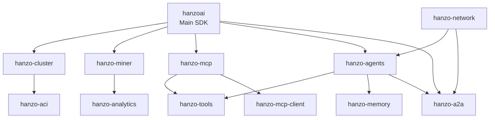

# Python SDK Monorepo Structure (Complete)

Transform python-sdk into a monorepo containing all Python packages except dev/ide:

```
python-sdk/
├── pkg/
│   ├── hanzoai/               # Core SDK (current src/hanzoai)
│   │   ├── pyproject.toml
│   │   ├── README.md
│   │   └── src/
│   │       └── hanzoai/
│   │           ├── __init__.py
│   │           ├── agents.py      # Imports from hanzo-agents
│   │           ├── mcp.py         # Imports from hanzo-mcp
│   │           ├── cluster.py     # Imports from hanzo-cluster
│   │           ├── a2a.py         # Imports from hanzo-a2a
│   │           └── ... (existing SDK files)
│   │
│   ├── hanzo-cluster/         # Local AI cluster management
│   │   ├── pyproject.toml
│   │   ├── README.md
│   │   └── src/
│   │       └── hanzo_cluster/
│   │           ├── __init__.py
│   │           ├── cluster.py
│   │           ├── exo_integration.py
│   │           ├── models.py
│   │           └── api.py
│   │
│   ├── hanzo-miner/           # Distributed compute mining
│   │   ├── pyproject.toml
│   │   ├── README.md
│   │   └── src/
│   │       └── hanzo_miner/
│   │           ├── __init__.py
│   │           ├── miner.py
│   │           ├── wallet.py
│   │           ├── rewards.py
│   │           └── network.py
│   │
│   ├── hanzo-mcp/             # MCP server and client (from ide/pkg/mcp)
│   │   ├── pyproject.toml
│   │   ├── README.md
│   │   └── src/
│   │       └── hanzo_mcp/
│   │           ├── __init__.py
│   │           ├── server.py
│   │           ├── cli.py
│   │           ├── tools/         # All MCP tools
│   │           └── prompts/
│   │
│   ├── hanzo-a2a/             # Agent-to-agent communication protocol
│   │   ├── pyproject.toml
│   │   ├── README.md
│   │   └── src/
│   │       └── hanzo_a2a/
│   │           ├── __init__.py
│   │           ├── protocol.py       # A2A wire protocol
│   │           ├── messaging.py      # Message passing
│   │           ├── discovery.py      # Agent discovery
│   │           ├── auth.py          # Agent authentication
│   │           ├── routing.py       # Message routing
│   │           └── bridge.py        # MCP<->A2A bridge
│   │
│   ├── hanzo-tools/           # Tool framework and base classes
│   │   ├── pyproject.toml
│   │   ├── README.md
│   │   └── src/
│   │       └── hanzo_tools/
│   │           ├── __init__.py
│   │           ├── base.py          # BaseTool class
│   │           ├── registry.py      # ToolRegistry
│   │           ├── context.py       # ToolContext
│   │           ├── permissions.py   # PermissionManager
│   │           ├── batch.py         # BatchTool
│   │           ├── pagination.py    # Pagination support
│   │           ├── streaming.py     # Streaming results
│   │           └── decorators.py    # Tool decorators
│   │
│   ├── hanzo-agents/          # Agent SDK (from ide/pkg/agents)
│   │   ├── pyproject.toml
│   │   ├── README.md
│   │   └── src/
│   │       └── hanzo_agents/
│   │           ├── __init__.py
│   │           ├── core/
│   │           ├── memory/
│   │           ├── routing/
│   │           └── cli/
│   │
│   ├── hanzo-network/         # Agent networks (from ide/pkg/hanzo_network)
│   │   ├── pyproject.toml
│   │   ├── README.md
│   │   └── src/
│   │       └── hanzo_network/
│   │           ├── __init__.py
│   │           ├── core/
│   │           └── tools/
│   │
│   ├── hanzo-memory/          # Memory and RAG tools
│   │   ├── pyproject.toml
│   │   ├── README.md
│   │   └── src/
│   │       └── hanzo_memory/
│   │           ├── __init__.py
│   │           ├── kv_store.py
│   │           ├── vector_store.py
│   │           ├── rag.py
│   │           └── embeddings.py
│   │
│   ├── hanzo-aci/             # AI Compute Interface (from ide/pkg/aci)
│   │   ├── pyproject.toml
│   │   ├── README.md
│   │   └── src/
│   │       └── hanzo_aci/
│   │           ├── __init__.py
│   │           └── ... (all aci code)
│   │
│   ├── hanzo-analytics/       # Analytics (from ide/pkg/analytics)
│   │   ├── pyproject.toml
│   │   ├── README.md
│   │   └── src/
│   │       └── hanzo_analytics/
│   │           ├── __init__.py
│   │           └── ... (all analytics code)
│   │
│   └── hanzo-mcp-client/      # MCP client library (if separate from server)
│       ├── pyproject.toml
│       ├── README.md
│       └── src/
│           └── hanzo_mcp_client/
│               ├── __init__.py
│               ├── client.py
│               └── transport.py
│
├── tests/                     # Unified test suite
│   ├── test_hanzoai/
│   ├── test_cluster/
│   ├── test_miner/
│   ├── test_mcp/
│   ├── test_a2a/
│   ├── test_tools/
│   ├── test_agents/
│   ├── test_network/
│   ├── test_memory/
│   └── test_integration/
│
├── docs/                      # Unified documentation
│   ├── api/
│   ├── guides/
│   ├── protocols/
│   └── examples/
│
├── examples/                  # Example code
│   ├── local_ai/
│   ├── agent_networks/
│   ├── mining/
│   ├── a2a_communication/
│   └── unified/
│
├── scripts/                   # Build and utility scripts
│   ├── build_all.py
│   ├── test_all.py
│   ├── publish.py
│   └── migrate_from_ide.py
│
├── Makefile                   # Top-level makefile
├── pyproject.toml            # Workspace configuration
├── README.md
└── .github/
    └── workflows/
        ├── ci.yml
        └── release.yml
```

## Package Relationships



## Migration Plan

### Phase 1: Setup Monorepo Structure
```bash
cd python-sdk
mkdir -p pkg
mv src/hanzoai pkg/hanzoai/src/hanzoai
```

### Phase 2: Extract Core Framework
1. Create pkg/hanzo-tools from ide/pkg/mcp/hanzo_mcp/tools/common/
2. Create pkg/hanzo-a2a as new protocol package

### Phase 3: Migrate from IDE monorepo
```bash
# From ide monorepo
cp -r pkg/mcp python-sdk/pkg/hanzo-mcp
cp -r pkg/agents python-sdk/pkg/hanzo-agents  
cp -r pkg/hanzo_network python-sdk/pkg/hanzo-network
cp -r pkg/aci python-sdk/pkg/hanzo-aci
cp -r pkg/analytics python-sdk/pkg/hanzo-analytics
```

### Phase 4: Extract and Refactor
1. Extract cluster code from hanzoai/cluster.py → pkg/hanzo-cluster
2. Extract miner code → pkg/hanzo-miner
3. Extract tool base classes → pkg/hanzo-tools
4. Create memory package from agent memory tools

### Phase 5: Update Dependencies
Each package declares its dependencies:

#### hanzoai/pyproject.toml
```toml
[project]
name = "hanzoai"
dependencies = []  # No direct deps, uses optional

[project.optional-dependencies]
cluster = ["hanzo-cluster>=0.1.0"]
miner = ["hanzo-miner>=0.1.0"]
mcp = ["hanzo-mcp>=0.1.0"]
agents = ["hanzo-agents>=0.1.0"]
a2a = ["hanzo-a2a>=0.1.0"]
all = ["hanzoai[cluster,miner,mcp,agents,a2a]"]
```

#### hanzo-mcp/pyproject.toml
```toml
[project]
dependencies = [
    "hanzo-tools>=0.1.0",
    "fastmcp>=0.1.0",
    "mcp>=0.1.0",
]
```

#### hanzo-agents/pyproject.toml
```toml
[project]
dependencies = [
    "hanzo-tools>=0.1.0",
    "hanzo-memory>=0.1.0",
    "hanzo-a2a>=0.1.0",
]
```

## Workspace Configuration

```toml
[project]
name = "hanzo-python-monorepo"
version = "2.0.0"
description = "Hanzo AI Python SDK Monorepo"

[tool.rye]
managed = true
workspace = { members = ["pkg/*"] }

[tool.rye.scripts]
# Development
dev = "rye sync --all-features"
test = "pytest tests/ -v"
lint = "ruff check pkg/"
format = "ruff format pkg/"
typecheck = "mypy pkg/"

# Build
build-all = "python scripts/build_all.py"
build = { chain = ["build:hanzo-tools", "build:rest"] }
"build:hanzo-tools" = "cd pkg/hanzo-tools && rye build"
"build:rest" = "python scripts/build_all.py --skip hanzo-tools"

# Testing
test-all = "python scripts/test_all.py"
test-unit = "pytest tests/ -v -m 'not integration'"
test-integration = "pytest tests/ -v -m integration"

# Publishing
publish-all = "python scripts/publish.py"
publish-test = "python scripts/publish.py --test-pypi"

# Migration
migrate = "python scripts/migrate_from_ide.py"
```

## Installation Examples

```bash
# For users - install what they need
pip install hanzoai                    # Core SDK only
pip install hanzoai[mcp]              # With MCP tools
pip install hanzoai[agents]           # With agents
pip install hanzoai[cluster]          # With local AI
pip install hanzoai[all]              # Everything

# For specific tools
pip install hanzo-mcp                 # Just MCP server/tools
pip install hanzo-agents              # Just agent SDK
pip install hanzo-cluster             # Just cluster management

# For developers - install everything in dev mode
cd python-sdk
rye sync --all-features
```

## Benefits

1. **Single Source of Truth**: All Python packages in one place
2. **Unified CI/CD**: One set of tests, one release process
3. **Better Integration Testing**: Test across packages easily
4. **Consistent Tooling**: Same build/test/lint setup everywhere
5. **Easier Dependency Management**: Rye workspace handles it all
6. **IDE keeps focus**: IDE monorepo only has dev/ide packages